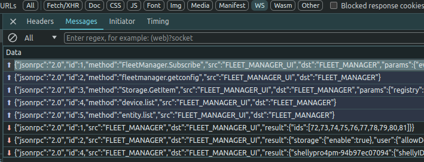

# Codebase 

## Backend

The backend module is the core of the Fleet Management. It is what powers everything else including the frontend, plugins and rpc relay. It is written in Node.js using Typescript. Running the backend requires Node.js 18 and above.  
The backend keeps open websocket connection to all connected Shelly devices. using websockets all the devices can be accessed faster and all devices can also send live notifications to Fleet Manager. The backend stores all the information for all connected devices (incl. statuses, settings and info) and also generates and sends events once the state of any of the devices changes. All events regarding the state change of Shelly devices are described in [Events](./events.md). When a connected Shelly device sends data to the server, the server passes it through its processing line. This includes updating the internal state of the server and notifying all listeners by sending events.

### Consuming backend

Application is based on pub/sub patter. It uses WebSocket for transfer protocol.

#### Client connects to backend (WebSocket)

connection should be made with jwt token, details can be seen in browser dev tools

#### Clients subscribes to specific events happened on backend side

Details can be seen in browser dev tools, network tab, ws filter. here is some example message send to backend.
it tells backend that this client that sent this msg wants to subscribe for the following events:

 `Shelly.Connect, Shelly.Disconnect, Shelly.Status, Shelly.Settings, Shelly.KVS, Shelly.Info, Shelly.Presence, Entity.Added, Entity.Removed, Entity.Event`

```json
{
    "jsonrpc": "2.0",
    "id": 1,
    "method": "FleetManager.Subscribe",
    "src": "FLEET_MANAGER_UI",
    "dst": "FLEET_MANAGER",
    "params": {
        "events": [
            "Shelly.Connect",
            "Shelly.Disconnect",
            "Shelly.Status",
            "Shelly.Settings",
            "Shelly.KVS",
            "Shelly.Info",
            "Shelly.Presence",
            "Entity.Added",
            "Entity.Removed",
            "Entity.Event"
        ],
        "options": {
            "events": {
                "Shelly.Status": {
                    "deny": [
                        "*:aenergy",
                        "*:consumption",
                        "em:*",
                        "em1:*",
                        "emdata:*",
                        "emdata1:*",
                        "wifi:*"
                    ]
                }
            }
        }
    }
}
```




### Project structure
```
backend/
├─ bin/          # Development scripts
├─ cfg/          # General Configuration
├─ dist/         # Executable javascript
├─ logs/         # Log files
├─ node_modules/ # Project dependencies
├─ plugins/      # Work dir for plugins
├─ src/          # Source code
```
### Plugins

Plugins stored in the `plugins` directory will be loaded on startup.

## Frontend
- found in `frontend` folder
- written in typescript
- Vue 3 with Composition API
- `bulma.io` as a css framework
- `pinia` as state manager

The frontend application gives a visual representation of the backend API. Once opened, the frontend application establishes a connection with the backend server using rpc calls over websocket. The frontend queries for all connected devices(using `Device.List`) and subscribed to receive notifications(using `FleetManager.Subscribe`). Once subscribed, it receives live data notifications for state changes for all connected devices.

The application UI is split into 4 pages:
- Devices: shows a banner for each device with easy controls
- Mass RPC: allows the user to write a rpc command and send it to one or more devices
- Data: Shows all incoming data from the outbound websockets of the Shelly devices
- Apply Config: Allows the user to apply a config to 1 or more devices. This is the equivalent of sending multiple RPC calls for different components. This allows for one device to copy the entire configuration of another device in one call.